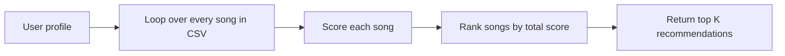

# 🎵 Music Recommender Simulation

## Project Summary

In this project you will build and explain a small music recommender system.

Your goal is to:

- Represent songs and a user "taste profile" as data
- Design a scoring rule that turns that data into recommendations
- Evaluate what your system gets right and wrong
- Reflect on how this mirrors real world AI recommenders

Replace this paragraph with your own summary of what your version does.

---

## How The System Works

Real-world recommendation systems usually combine many signals at once, such as a user's past interactions, similar users, and how closely a new item matches those preferences. In this simulation, we simplify that idea by comparing each song to a specific user profile and assigning it a score based on how well it matches. Our version will prioritize clear, interpretable matches, especially genre, mood, and energy, so it is easy to see why a song is recommended.

A sample user profile for this simulation could be:

```python
user_profile = {
    "favorite_genre": "pop",
    "favorite_mood": "happy",
    "target_energy": 0.8,
    "likes_acoustic": False,
}
```

This profile is useful because it gives the recommender a clear target for genre, mood, and energy, so it can distinguish between songs such as a high-energy rock track and a chill lofi track. It is still somewhat narrow, though, because it assumes the user only wants one genre and one mood at a time, which may cause the system to miss strong alternatives that are slightly different.

The simulation uses the following features:

- Song features: genre, mood, energy, tempo, valence, danceability, acousticness
- UserProfile features: favorite genre, favorite mood, target energy, and a preference for acoustic tracks

The finalized algorithm recipe is:

1. Start with the user profile dictionary.
2. For each song, add points for:
   - Genre match: +2.0 if the song's genre matches the user's favorite genre.
   - Mood match: +1.0 if the song's mood matches the user's favorite mood.
   - Energy similarity: add $1 - |\text{song energy} - \text{target energy}|$.
   - Acoustic similarity: add $1 - |\text{song acousticness} - \text{preferred acousticness}|$, where the target is 0.8 for acoustic-loving users and 0.2 otherwise.
3. Sum the points, rank the songs from highest to lowest, and return the top $k$ recommendations.

A simple flow for the design looks like this:



This system may over-prioritize genre and under-value a song that is a great mood match but a different genre. That is a realistic bias in simple recommender systems, and it is important to note it in the design.

---

## Getting Started

### Setup

1. Create a virtual environment (optional but recommended):

   ```bash
   python -m venv .venv
   source .venv/bin/activate      # Mac or Linux
   .venv\Scripts\activate         # Windows

2. Install dependencies

```bash
pip install -r requirements.txt
```

3. Run the app:

```bash
python -m src.main
```

### Running Tests

Run the starter tests with:

```bash
pytest
```

You can add more tests in `tests/test_recommender.py`.

---

## Sample Recommendation Output

Example output from running the CLI with a pop/happy profile:

```text
Loaded songs: 18

Top recommendations:

Sunrise City             | Score:  4.96 | Score 4.96 because: genre match (+2.0), mood match (+1.0), energy similarity (0.98), acoustic similarity (0.98)
Gym Hero                 | Score:  3.73 | Score 3.73 because: genre match (+2.0), mood mismatch, energy similarity (0.87), acoustic similarity (0.85)
Rooftop Lights           | Score:  2.87 | Score 2.87 because: genre mismatch, mood match (+1.0), energy similarity (0.96), acoustic similarity (0.85)
Night Drive Loop         | Score:  1.91 | Score 1.91 because: genre mismatch, mood mismatch, energy similarity (0.95), acoustic similarity (0.98)
Winter Window            | Score:  1.88 | Score 1.88 because: genre mismatch, mood mismatch, energy similarity (0.94), acoustic similarity (0.95)
```

**Screenshot or video** *(optional)*: <!-- Insert a screenshot or demo video link here -->

---

## Experiments You Tried

Use this section to document the experiments you ran. For example:

- What happened when you changed the weight on genre from 2.0 to 0.5
- What happened when you added tempo or valence to the score
- How did your system behave for different types of users

---

## Limitations and Risks

Summarize some limitations of your recommender.

Examples:

- It only works on a tiny catalog
- It does not understand lyrics or language
- It might over favor one genre or mood

You will go deeper on this in your model card.

---

## Reflection

Read and complete `model_card.md`:

[**Model Card**](model_card.md)

Write 1 to 2 paragraphs here about what you learned:

- about how recommenders turn data into predictions
- about where bias or unfairness could show up in systems like this


