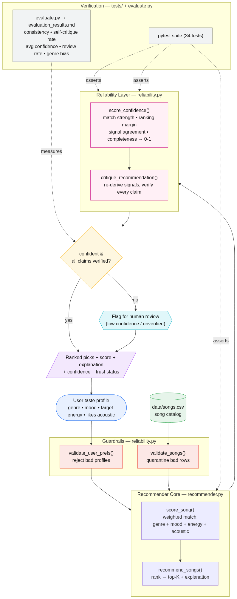
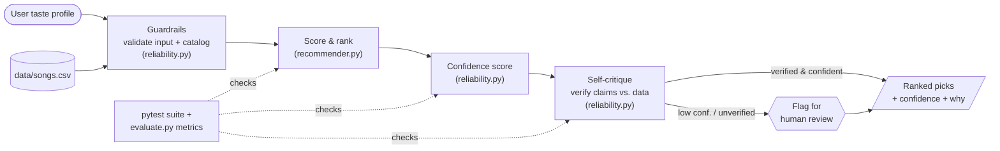

# 🎧 VibeFinder — A Trustworthy Music Recommender

A music recommender that doesn't just tell you *what* to play — it tells you
**how sure it is** and **checks its own reasoning** before asking you to trust it.

---

## Base Project

This project extends **AI110 Module 3 — Music Recommender Simulation** (a graded
"show" project). The original system represented songs and a user "taste
profile" as data, scored each song against that profile with a weighted rule
(genre, mood, energy, acousticness), ranked the catalog, and returned the top-K
songs with a plain-English explanation of each pick. Its goal was to show, in a
transparent and interpretable way, how a recommender turns data into ranked
predictions — and to surface where bias (over-weighting genre) can creep in.

## Title and Summary

**VibeFinder** keeps that transparent scoring core and wraps it in a
**reliability layer** so the system can be trusted, not just run. On top of the
original score-and-explain pipeline it adds:

- **Confidence scoring** — every recommendation gets an explainable `0.0–1.0`
  confidence built from four transparent factors.
- **Self-critique / validation** — the system re-derives the truth from the raw
  data and verifies every claim in its own explanation.
- **Human-review flagging** — low-confidence or unverifiable picks are flagged
  for a human instead of being presented as confident.
- **Guardrails + logging** — malformed input is rejected safely and every stage
  of a run is logged.
- **An evaluation harness** — measurable reliability metrics (including a
  bias metric), written to a reproducible report.

**Why it matters:** recommenders shape what people listen to, yet most present
every result with the same unearned confidence. VibeFinder models the
responsible-AI idea that a system should *know what it doesn't know* — quantify
its certainty, check its own claims, and defer to a human when it isn't sure.

This is the **Reliability / Testing System** advanced feature, and it is fully
integrated: the confidence score and self-critique change what every
recommendation *is* — they flow through the same pipeline every consumer uses,
not a side script printed next to the answer.

## Architecture Overview

Data flows **input → validate → score & rank → confidence → self-critique →
output**, with a human-review checkpoint for anything the system can't stand
behind. The Mermaid source is in
[`diagrams/architecture.mmd`](diagrams/architecture.mmd) (rendered with a legend
in [`diagrams/README.md`](diagrams/README.md)).



*(Rendered from [`diagrams/architecture.mmd`](diagrams/architecture.mmd); the
interactive version below renders natively on GitHub.)*



| Component | File | Role |
|-----------|------|------|
| Recommender core | `src/recommender.py` | Scores, ranks, and explains (from Module 3) |
| Reliability layer | `src/reliability.py` | Validation, confidence, self-critique |
| Pipeline | `src/pipeline.py` | Single guarded, logged entry point |
| CLI | `src/main.py` | Runs a profile and prints results |
| Evaluation | `src/evaluate.py` | Reliability + bias metrics report |
| Logging | `src/logging_setup.py` | Shared, consistent run logging |

## Setup Instructions

**Requirements:** Python 3.9+ (developed on 3.13). No API keys, no network, no
services — the system is fully offline.

```bash
# 1. From the repository root, (optionally) create a virtual environment
python -m venv .venv
source .venv/bin/activate        # macOS/Linux
.venv\Scripts\activate           # Windows

# 2. Install dependencies
pip install -r requirements.txt

# 3. Run the recommender (defaults to a pop / happy profile)
python -m src.main

# 4. Try a different taste profile
python -m src.main --genre lofi --mood chill --energy 0.35 --acoustic -k 3

# 5. Run the reliability evaluation (writes evaluation_results.md)
python -m src.evaluate

# 6. Run the tests
python -m pytest
```

> On some Windows setups `python` opens the Microsoft Store; use `py` instead
> (e.g. `py -m src.main`).

## Sample Interactions

Full, unedited captures live in [`docs/sample_runs.md`](docs/sample_runs.md).
Three representative examples:

**1) Default profile — confident picks trusted, weak picks flagged:**

```text
Sunrise City     | Score: 4.96 | Confidence: 1.00 (high  )        | genre match (+2.0), mood match (+1.0), energy similarity (0.98), acoustic similarity (0.98)
Gym Hero         | Score: 3.73 | Confidence: 0.81 (high  )        | genre match (+2.0), mood mismatch, energy similarity (0.87), acoustic similarity (0.85)
Night Drive Loop | Score: 1.91 | Confidence: 0.36 (low   ) REVIEW | genre mismatch, mood mismatch, energy similarity (0.95), acoustic similarity (0.98)
   -> flagged for review: low confidence (0.36 < 0.50)

Self-critique: 3/5 recommendation(s) verified and trusted; 2 flagged for human review.
```

**2) A different profile — honest about a close call:**

```text
$ python -m src.main --genre lofi --mood chill --energy 0.35 --acoustic -k 3

Library Rain    | Score: 4.97 | Confidence: 0.73 (medium)         | genre match (+2.0), mood match (+1.0), energy similarity (1.00), acoustic similarity (0.94)
Midnight Coding | Score: 4.85 | Confidence: 0.97 (high  )         | genre match (+2.0), mood match (+1.0), energy similarity (0.93), acoustic similarity (0.91)
```

*Library Rain scores highest but gets only medium confidence — it barely beat
the runner-up, so the system flags the ordering as uncertain rather than
overclaiming.*

**3) Invalid input is handled safely (guardrail):**

```text
$ python -m src.main --genre ""

Input rejected: A non-empty 'favorite_genre' is required.
Could not produce recommendations: A non-empty 'favorite_genre' is required.
```

## Design Decisions

- **Reliability layer over a new model.** The most *responsible* upgrade to a
  simple recommender isn't a fancier model — it's making the existing one honest
  about its certainty. So the extension adds confidence + self-critique rather
  than a black-box ranker.
- **Fully offline and deterministic.** No LLM/API. Trade-off: explanations stay
  templated rather than free-form natural language. In exchange, the system is
  perfectly reproducible (critical for grading and for trustworthy evaluation)
  and has zero external dependencies or keys.
- **Self-critique recomputes signals independently.** The critique deliberately
  re-derives match signals separately from the scorer, so the two act as a
  cross-check. Trade-off: a little duplicated logic, bought for the ability to
  catch data/logic drift.
- **Confidence blends four transparent factors** (match strength, ranking
  margin, signal agreement, completeness) instead of one. A single factor (e.g.
  raw score) would hide *why* the system is unsure; the breakdown is inspectable.
- **Flag, don't hide.** Low-confidence picks are still shown, clearly marked for
  human review — the human stays in the loop rather than being silently
  overruled.

## Testing Summary

`python -m pytest` → **34 tests pass** (input validation, match signals,
confidence bounds/ordering/labels, self-critique catching false claims, and the
evaluation harness). `python -m src.evaluate` over 4 profiles / 20
recommendations reports:

- **Consistency: 100%** — identical output on repeated runs (deterministic).
- **Self-critique pass rate: 100%** — every claim in every explanation verified
  against the data.
- **Average confidence: 0.61**, with **50% of recommendations flagged** for
  review (mostly weak cross-genre matches — the system is appropriately cautious).
- **Genre-dominance (bias) metric: 0.35** — quantifies the known tendency to
  skew top results toward the favorite genre.

**What worked:** the guardrails and self-critique caught exactly the cases they
should, and confidence tracked intuition (decisive matches high, narrow wins
lower). **What was tricky:** confidence weighting needed tuning so a narrow #1
win reads as "medium," not "certain." **What I learned:** measuring reliability
made the system's *limits* visible — see the evaluation and the model card.

Full metrics: [`evaluation_results.md`](evaluation_results.md).

## Reflection

The graded responsible-AI reflection — how I collaborated with AI, one helpful
and one flawed AI suggestion, biases, and the system's limitations — is in
[`model_card.md`](model_card.md).
