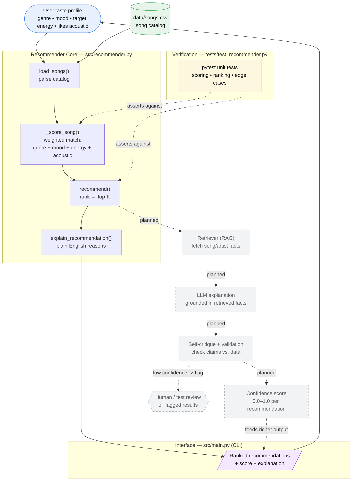

# System Architecture

The **canonical source** for the architecture diagram is [`architecture.mmd`](architecture.mmd)
(Mermaid source). Edit that file, then optionally export a PNG into
[`../assets/`](../assets/) for embedding in the main README.

To preview or export: open <https://mermaid.live> and paste the contents of
`architecture.mmd`.

- **Solid nodes** = the current Module-3 Music Recommender (input → load catalog →
  score → rank → explain → output), plus the pytest suite that checks the results.
- **Dashed nodes** = the planned final-project AI extension (retrieval, grounded
  explanation, self-critique/validation, confidence scoring, human/test review).
  These are **not yet implemented** — they mark where new components will slot in.

The diagram below is a rendered copy kept in sync with `architecture.mmd` so it
displays directly on GitHub.

## Legend

| Layer | Component | Role |
|-------|-----------|------|
| Input | User taste profile + `data/songs.csv` | Preferences and the song catalog |
| Core | `src/recommender.py` | Scores, ranks, and explains recommendations |
| Interface | `src/main.py` (CLI) | Runs the pipeline and prints results |
| Verification | `tests/test_recommender.py` | pytest checks on scoring, ranking, edge cases |
| *Planned* | Retriever · LLM explainer · Self-critique · Confidence | The final-project AI feature (not yet built) |
