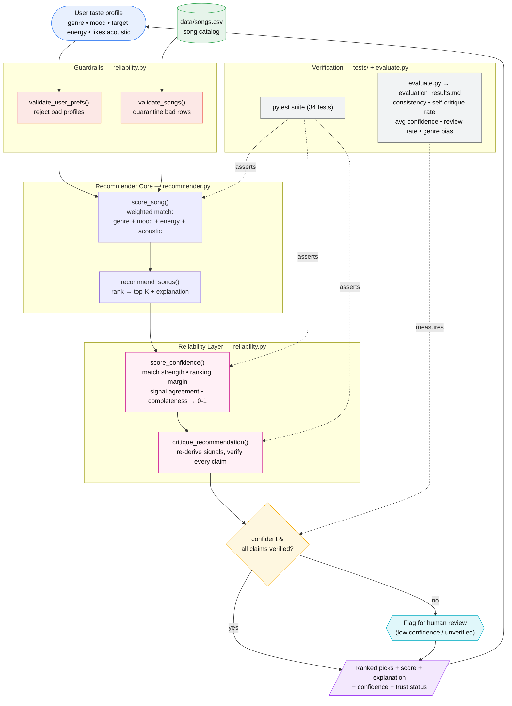

# System Architecture

The **canonical source** for the architecture diagram is [`architecture.mmd`](architecture.mmd)
(Mermaid source). Edit that file, then optionally export a PNG into
[`../assets/`](../assets/) for embedding in the main README.

To preview or export: open <https://mermaid.live> and paste the contents of
`architecture.mmd`.

Data flows **input → guardrails → score & rank → confidence → self-critique →
decision → output**, with a human-review checkpoint for anything the system
cannot verify or isn't confident about. The pytest suite and the evaluation
harness check the AI results at the points shown.

The diagram below is a rendered copy kept in sync with `architecture.mmd` so it
displays directly on GitHub.

## Legend

| Layer | Component | Role |
|-------|-----------|------|
| Input | User taste profile + `data/songs.csv` | Preferences and the song catalog |
| Guardrails | `reliability.validate_*` | Reject bad profiles, quarantine bad rows |
| Core | `recommender.py` | Scores, ranks, and explains |
| Reliability | `reliability.score_confidence` / `critique_recommendation` | Confidence + self-critique |
| Decision | pipeline | Trust, or flag for human review |
| Verification | `tests/` + `evaluate.py` | Automated checks + reliability metrics |

_All components above are implemented. `pipeline.py` orchestrates the flow and
logs every stage._
